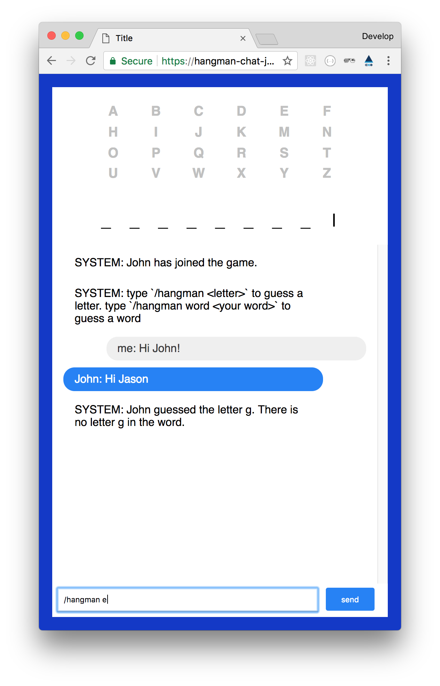

# Hangman Chat
This is a simple chat where you can play hangman and hang around in. The goal of the game is to guess the randomly given word withing 10 attempts.

Live right [HERE][live]

# Table of Content
- [Getting started](#getting-started)
- [How to build](#how-to-build)
- [Features](#features)
- [Whats used](#whats-used)
- [How to play](#how-to-play)
- [To Do](#to-do)

# Getting started
Here is how to get started:
1. Clone the repo `git clone https://github.com/kyunwang/real-time-web.git` or download it.
2. Navigate to the hangman folder `cd hangman-chat`
3. Run `npm install` or `yarn`
4. Do a `npm run watch`
5. Go to [localhost:3100](localhost:3100) and you are ready to go.

# How to build
This repo makes use of ES6 and also the ES6 imports the following steps are required before deploying to production.
Follow these steps to build the project for production:

1. Complete the **Getting started** steps
2. Run `npm run build` // Will compile the server and client-side javascript
3. Now you got you can host the server/app!

# Features
This app contains the following features:
- You can chat in a chatroom.
- You can set a temporary username for the chatroom
- You can play hangman with other in the chatroom
	- You can guess with a letter by typing `/hangman <Your letter>`
	- You can guess the word by typing `/hangman word <Your word>`

# Whats used
- [Socket.io](https://socket.io/) - For real time functionality
- [Pug](https://pugjs.org/api/getting-started.html) - Templating

# How to play
How to play the hangman game?

You will enter the *hangman* mode by typing `/hangman` and a letter or `word` then your word afterwards. See this table for some clarity.

| **Command** | **Note** | **Example** |
| :---------: | ----------- | ----------- |
|      /hangman `letter`      |   You will guess a letter with this command. If you input a word, only the first letter wll be taken       | /hangman l |
|      /hangman word `word`      |    You use this command if you want to guess a word.    | /hangman word conference |

# To Do
- [x] Finishing the app, making the game real like hangman.
- [ ] Attach the wordAPI for random words (HArd coded at the moment)
- [ ] Ability to restart the game when finished
- [ ] Give feedback to the user if a letter has already been used before
- [ ] Show the users already guessed words
- [ ] Add lives to the game (10 lives)
- [ ] Add some better styling to the messages (e.g. different colors and distinction between username and message)

[live]: https://hangman-chat-jzqjvleedl.now.sh/